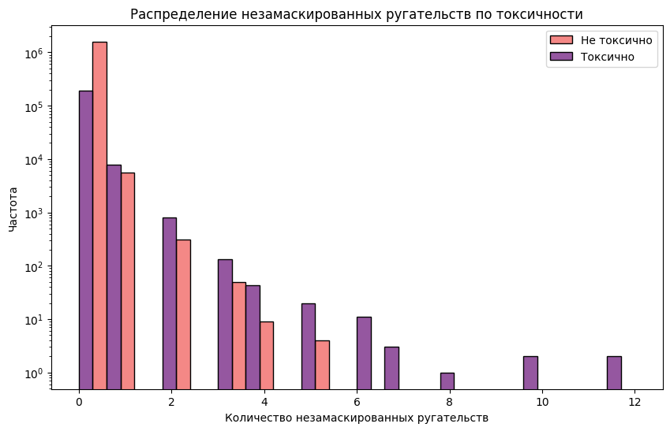

# Исправление опечаток и ругательств

Были проведены эксперименты по улучшению обработки текста, а конкретно по замене замаскированных ругательств на явные формы и исправлению опечаток в тексте.

Поиск ругательств производился при помощи регулярных выражений, охватывающих самые популярные маски самых популярных ругательств. Во время исследований выяснилось, что ругательств в наших данных не много (по крайней мере тех, что нашлись по регуляркам) - `16581` из 100кк+, причем замаскировано из них совсем мало - `719`.

Были проведены тесты на равенство средних: замаскированных ругательств в токсичных и нетоксичных комментариях и незамаскированных в этих же группах, а также замаскированных и незамаскированных только в токсичных. Результаты тестов показали, что в токсичных комментариях ругательств больше, особенно незамаскированных. В токсичных комментариях количество замаскированных ругательств сильно меньше, чем незамаскированных, в таком случае замаскированные ругательства лучше приводить к явному виду, т.к. они не представляют важности для модели и могут наоборот запутать ее.

Далее была проведена работа по исправлению опечаток. Для их нахождения/исправления были опробованы библиотеку pyspellchecker и SymSpell, по итогу выбор был сделан в пользу второго, т.к. Он быстрее и допускает меньше ложных исправлений, также в него можно загружать различные словари. Опечаток оказалось значительно больше, чем ругательств (`1755843`), больше их оказалось в токсичных комментариях.

Было решено исправлять их перед обучением/инференсом, т.к. они в себе ничего не несут и только раздувают словарь токенов.

В итоге был реализован класс для предобработки текста, в который, помимо исправления опечаток и ругательств, вошла лемматизация, удаление ссылок, удаление стоп-слов и очистка пунктуации, алгоритм которой удаляет всю пунктуацию, кроме той, что может показывать эмоциональность (тоже с помощью регулярки).

Новый алгоритм был проверен на нашей лучшей модели, разница в метрике `F1` оказалась околонулевой на тренировочной, валидационной и тестовой выборках.

| Алгоритм предобработки | Train | Val  | Test |
|------------------------|-------|------|------|
| Предыдущий             | 0.68  | 0.66 | 0.66 |
| Текущий                | 0.67  | 0.66 | 0.66 |

Хотя прироста в плане метрик новый алгоритм предобработки в нашем случае не дал, его все равно лучше использовать, чтобы очистить словарь токенов от несуществующих “слов” и не путать модель кривым входным текстом при предсказании.
