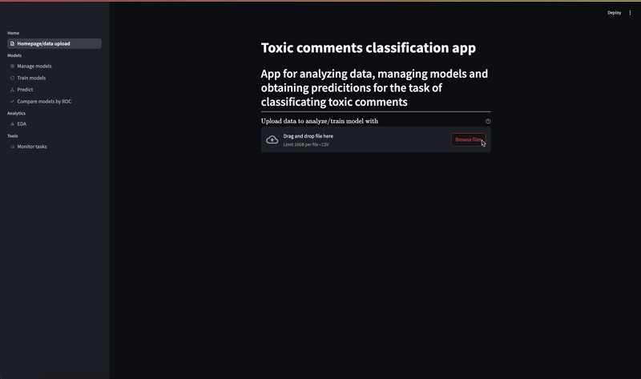
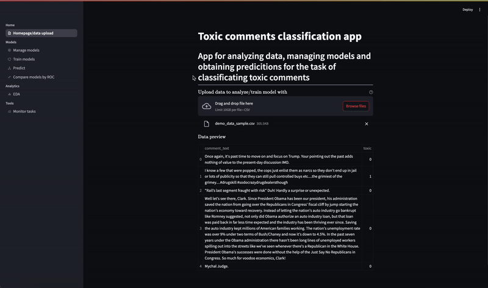
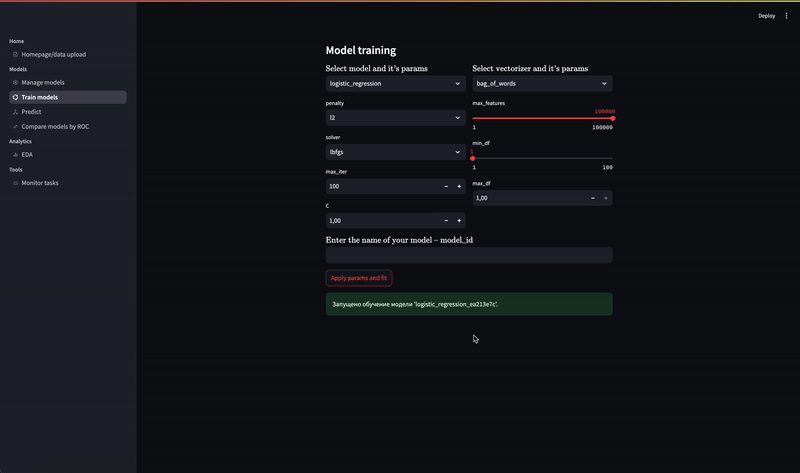
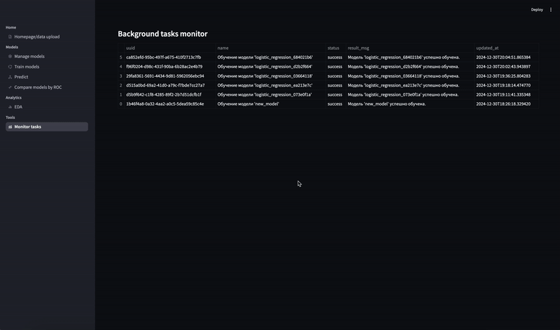
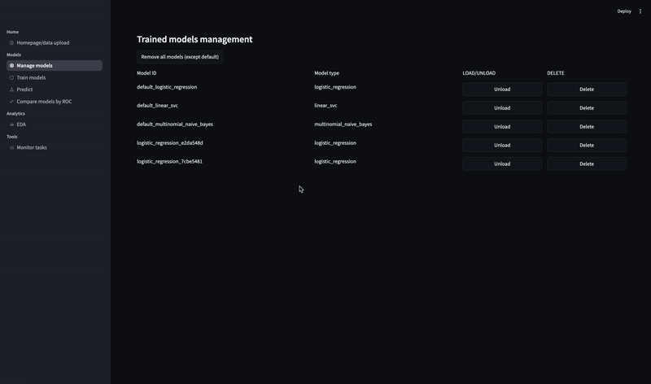
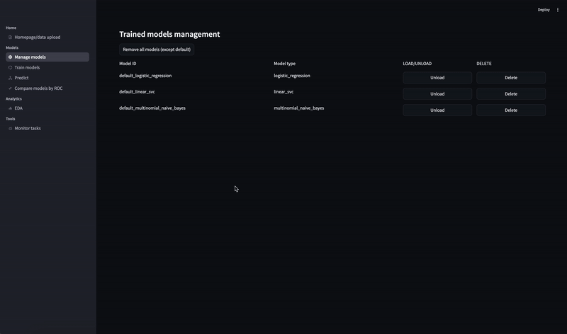
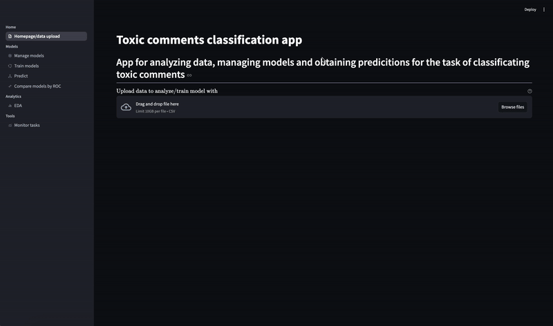
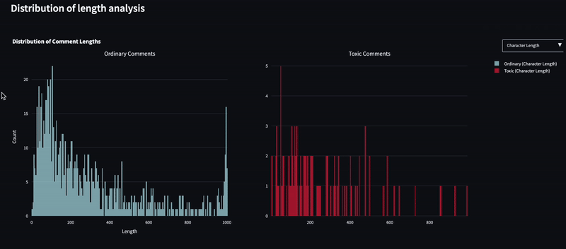
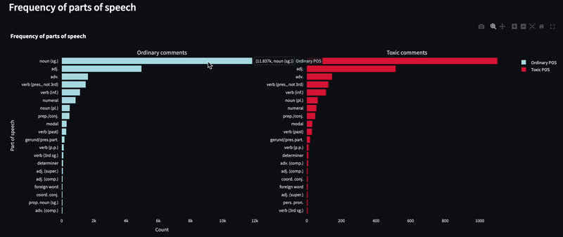

# USER GUIDE

_Здесь описаны принципы взаимодействия пользователя с интерфейсом приложения, детали технической реализации см. в [REPORT.md](./REPORT.md)._

Адрес сервиса: http://89.110.90.133/

## Начало работы с приложением

Главной точкой входа в интерфейс приложения является вкладка <u>__`Homepage/data upload`__</u>: вы загружаете файл `.csv`-файл с данными для обучения моделей и (или) разведочного анализа. Обязательным требованием к формату загружаемого файла является наличие следующих столбцов: 1) `comment_text` (содержит необработанный текст) и 2) `toxic` (содержит бинарную метку токсичности). После загрузки вы можете просмотреть sample из загруженного файла. Для удобства в корне директории `SERVICE/` в репозитории проекта мы поместили файл `demo_data_sample.csv` - его можно использовать для демонстрации работы приложения.

## Обучение моделей

Для того, чтобы обучить модели машинного обучения на загруженных данных необходимо перейти во вкладку <u>__`Train models`__</u>. Далее необходимо выбрать составляющие пайплайна для обучения: 1) одно из доступных семейств моделей машинного обучения, 2) один из доступных векторизаторов. Затем можно выбрать геперпараметры в зависимости выбранной модели. После выбора гиперпараметров нажмите кнопку `Apply params and fit` для подтверждения и отправки на сервер запроса на обучение модели.

## Мониторинг фоновых задач

Для того, чтобы узнать состояние обучения модели необходимо перейти на вкладку <u>__`Monitor tasks`__</u>. В случае, если в колонке `status` напротив вашей модели появляется значение _success_, то модель прошла обучение и готова к инференсу. Если что-то пошло не так - вы увидите текст ошибки.

## Управление моделями

Для того, чтобы в дальнейшем использовать обученную модель необходимо перейти во вкладку <u>__`Manage models`__</u> и нажать рядом с названием обученной модели кнопку `Load`. Изначально в сервисе доступны предобученные на большом объеме данных модели логистической регрессии, SVM с линейным ядрос и модель наивного байеса подобранными отдельно гиперпараметрами. Также можно удалять обученные пользователем модели. Есть вариант либо удалить из сервиса определенную модель нажав кнопку `Delete` напротив названия модели, либо можно удалить все модели, обученные пользователем, нажав кнопку `Remove models (except default)` (дефолтные предобученные модели удалить нельзя).

#### Delete

#### Remove models (except default)

### Получение предсказаний (демонстрация работы модели)

На вкладке <u>__`Predict`__</u> можно получить предсказание токсичности для нескольких текстов, выбрав модель и введя тексты для предсказаний в соответствующее окно (разделитель - перенос строки), после чего нажав кнопку `Obtain predictions`

### Сравнение обученных моделей

В сервисе имеется возможность сравнить модели на основе ROC кривых и значений ROC-AUC. Для этого необходимо перейти во вкладку <u>__`Compare models by ROC`__</u>, после чего выбрать одну или несколько моделей для сравнения в поле `Select a model`, а затем нажать кнопку `Plot`. Для построения графиков будут использованы ранее загруженные данные, однако есть возможность построения на новых данных - необходимо убрать галочку `Use previous (train) data` и загрузить новый файл в появившуюся форму. 

## EDA

В сервисе имеется возможность отображения интерактивных аналитических графиков для разведочного анализа данных. Для этого после загрузки данных необходимо перейти на вкладку <u>__`EDA`__</u> и немного подождать, пока преобразуются данные и отрисуются графики. На выходе для пользователя будут доступны три графика: график распределения длины текста, график частотности частей речи и графики частотности токенов (N-грамм) в комментариях в зависимости от метки токсичности. 

### График распределения длины текста

### График частоты частей речи

### Графики частоты слов

