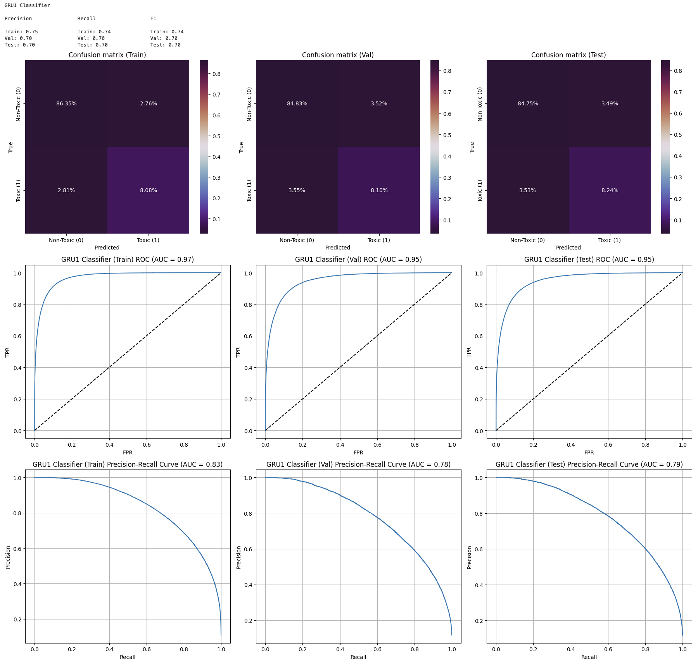

# Описание дополнительных экспериментов с RNN моделями

- Данный эксперимент был проведен исходя из того, что не было удовлетворенности метриками, которые были получены в ходе основных экспериментов с моделями **LSTM** и **GRU**. Во время этих экспериментов были получены метрика F-1 от примерно 0.5 до 0.64. Эти метрики хуже на 3-24%, чем у лучшего ML решения, которое было получено в ходе проекта.

- Дополнительные эксперименты проводились с использованием стандартного токенизатора из библиотеки `spacy` без использования предобученных эмбедингов.

- По итогу экспериментов модели **GRU** и **LSTM** демонстрировали примерно схожие результаты c метриками F-1 от примерно 0.67 до 0.7 и метриками PR-AUC от 0.75 до 0.78, что уже превосходит по метрикам лучшее ML решение.

- Довольно интересным оказалось  то, что моделью, которая проявила себя лучше всего оказалась однослойная базовая **GRU** cо следующими метриками на тестовой выборке:

  
    - $F-1 = 0.7$
    - $PR-AUC = 0.78$

- Это результат уже выше на 6% по метрике F-1 и на 5% по метрике PR-AUC, чем у лучшего решения ML полученного в ходе экспериментов.

- В качестве бонуса, было добавлено обучение этой же модели на собственных эмбедингах Word2Vec. Однако это не дало какого-либо прироста в метриках.

- Метрики и графики для лучшей модели:

