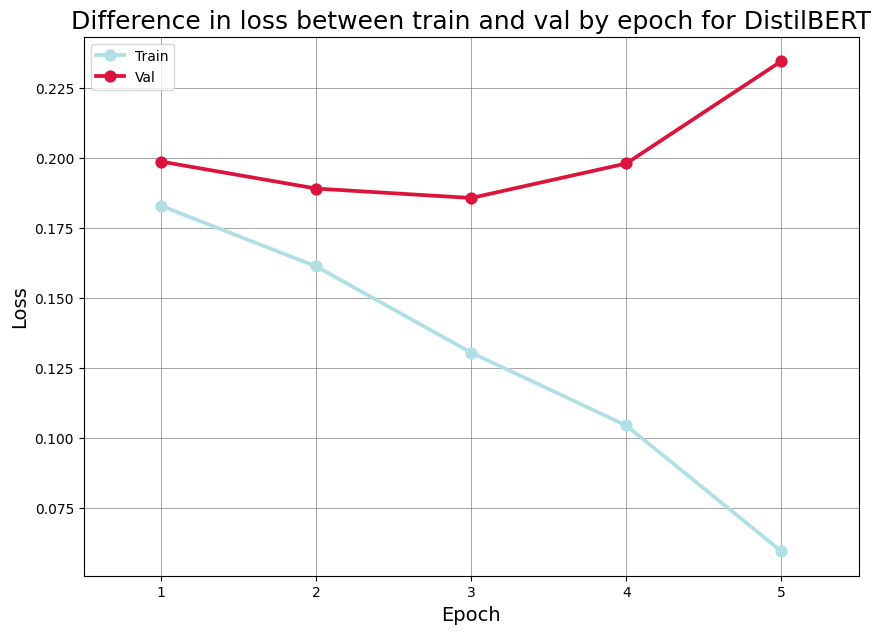
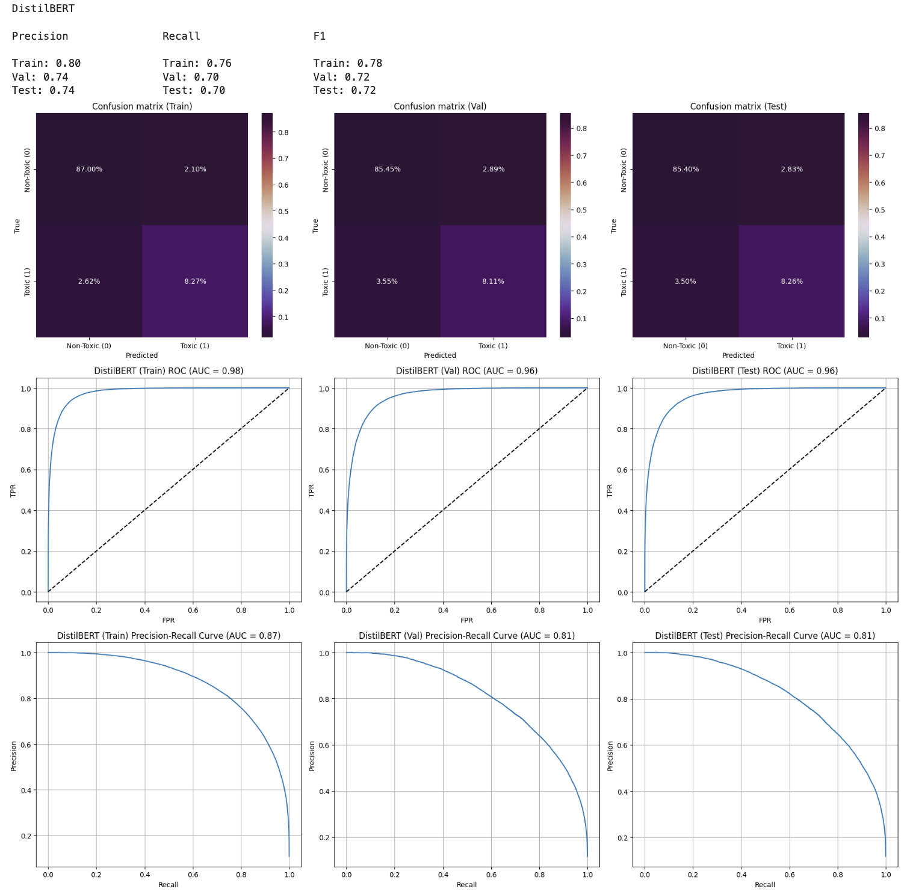
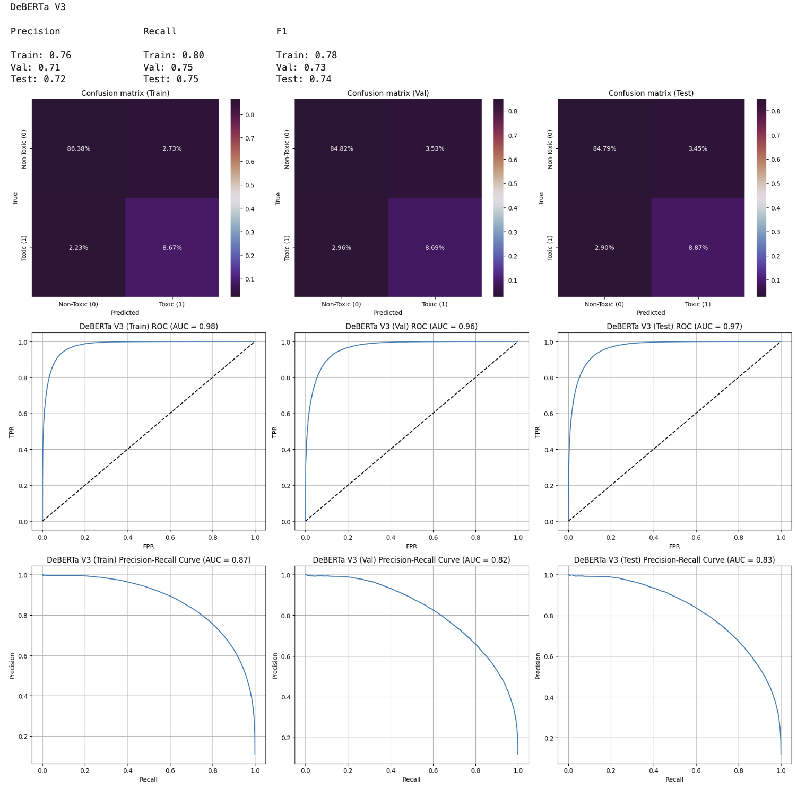

# Описание экспериментов с трансформерами для бинарной классификации токсичных комментариев

## Подготовка данных

- Для эксперементов были взяты данные с минимальной предобработкой текстов. Из них были удалены только ссылки и лишние пробелы. Также к данным применялись определенные токенизаторы, которые соответствовали моделям трансформеров.
- Комментарии были отсортированны по времени создания. После этого они были поделены на выборки train/test/val по отрезкам времени, где сначала было сделано деление на всех данных в соотношении 80/20 на train и test, а затем было сделано деление на train и val в соотношении 80/20 от train выборки.
- При делении на выборки train/val/test, была сохранена пропорция обычных и токсичных комментариев с соотношением 89-90% на 10-11%.

## Эксперименты с дообучением трансформеров на малых данных

- Для того, чтобы минимизировать временные затраты, было принято решение уменьшить выборку для экспериментов, целью которых являлся выбор финальных моделей для сервиса и демонстрации максимальных результатов дообучения моделей трансформеров.
- По итогу для экспериментов было взято 150 тысяч наблюдений, 96 тысяч из которых были использованны для дообучения моделей.
- Данные для экспериментов были получены путем семплирования выборок train/val/test. Чтобы обеспечить повторяемость экспериментов параметр `random_state` был зафиксирован.

### DistilBERT

Для начала рассмотрим одну из самых простых моделей трансформеров **DistilBERT**. Эта модель довольно быстро дообучается по сравнению с другими моделями, так как имеет в своей основе 6 слоев. При этом всем данная модель способна выдавать достаточно конкурентные результаты по метрикам. **DistilBERT** из-за своей легковесности был использован для экспериментов с подбором оптимального количества эпох необходимых для дообучения трансформеров на наших данных. Для того, чтобы не тратить время попусту модель обучалась с ранней остановкой. Параметр максимального количества эпох был поставлен на 40, но при этом, если в течении следующих двух эпох `loss` у валидации не снизится, то обучение остановится. Таким образом были получены следующие результаты представленные на таблице и графике.

| loss    | roc_auc | pr_auc  | f1      | accuracy | precision | recall  | epoch | dataset |
|---------|---------|---------|---------|----------|-----------|---------|--------|----------|
| 0.182742| 0.934728| 0.720343| 0.642920| 0.928156 | 0.700079  | 0.594390| 1      | train    |
| 0.198555| 0.931408| 0.706629| 0.635411| 0.920292 | 0.692851  | 0.586765| 1      | val      |
| 0.161137| 0.956396| 0.790756| 0.712237| 0.935010 | 0.687227  | 0.739135| 2      | train    |
| 0.188933| 0.945036| 0.752039| 0.679271| 0.920833 | 0.652611  | 0.708201| 2      | val      |
| 0.130364| 0.971765| 0.850650| 0.772608| 0.948635 | 0.745351  | 0.801934| 3      | train    |
| 0.185571| 0.948450| 0.762749| 0.687468| 0.923208 | 0.663285  | 0.713481| 3      | val      |
| 0.104377| 0.983635| 0.912182| 0.823419| 0.958781 | 0.771211  | 0.883209| 4      | train    |
| 0.197888| 0.947397| 0.761405| 0.687242| 0.921042 | 0.646986  | 0.732841| 4      | val      |
| 0.059505| 0.993298| 0.960843| 0.900912| 0.978729 | 0.913501  | 0.888666| 5      | train    |
| 0.234381| 0.943611| 0.751126| 0.670975| 0.925750 | 0.705631  | 0.639564| 5      | val      |

Как можно заметить в случае с нашими данными модель трансформера начинает переобучаться уже на 3 эпохе. При этом метрики на валидации с каждой эпохой после 3 становятся все хуже. Из-за этого было принято решение остановиться на 3 эпохах при проведении последующих экспериментов уже с другими моделями трансформеров.

Если говороить про метрики, то они весьма достойные, если сравнивать их с лучшими полученными ML решениями. Если смотреть на наши основные метрики для семпла тестовой выбрки, то мы получили значения F-1 = 0.69 и PR-AUC = 0.76. Однако это только семпл тестовой выборки. Если говорить про полную тестовую выборку, то были получены F-1 = 0.674 и PR-AUC = 0.753. Это уже выше, чем лучшее ML решение и при этом всем модель была обучена только на 96 тысячах наблюдений, когда как ML решения были обучены на полной выборке.

### Эксперименты с остальными моделями на малых данных

Чтобы это описание не превратилось в огромную статью на хабре, было решено объединить результаты по другим моделям в один блок с таблицей.

| model                         | epoch | dataset | loss    | f1      | accuracy | precision | recall  | pr_auc  | roc_auc |
|-------------------------------|-------|---------|---------|---------|----------|-----------|---------|---------|---------|
| BERT                          | 2     | train   | 0.09969 | 0.79851 | 0.96101  | 0.90385   | 0.71517 | 0.90487 | 0.98219 |
| BERT                          | 2     | val     | 0.17659 | 0.65973 | 0.93188  | 0.78465   | 0.56912 | 0.77793 | 0.95146 |
| RoBERTa                       | 2     | train   | 0.10907 | 0.77447 | 0.95588  | 0.86470   | 0.70128 | 0.88292 | 0.97839 |
| RoBERTa                       | 2     | val     | 0.16958 | 0.66871 | 0.93250  | 0.77672   | 0.58707 | 0.77981 | 0.95281 |
| RoBERTa Large                 | 2     | train   | 0.08522 | 0.83227 | 0.96634  | 0.90148   | 0.77293 | 0.92511 | 0.98722 |
| RoBERTa Large                 | 2     | val     | 0.17124 | 0.68002 | 0.93279  | 0.75975   | 0.61544 | 0.78409 | 0.95402 |
| DeBERTa v3 504 tokens         | 2     | train   | 0.11327 | 0.77489 | 0.95469  | 0.83626   | 0.72192 | 0.87238 | 0.97645 |
| DeBERTa v3 504 tokens         | 2     | val     | 0.16840 | 0.68360 | 0.93254  | 0.75000   | 0.62801 | 0.78747 | 0.95488 |
| DeBERTa v3 Large 192 tokens   | 2     | train   | 0.08838 | 0.83716 | 0.96685  | 0.89203   | 0.78864 | 0.92012 | 0.98586 |
| DeBERTa v3 Large 192 tokens   | 2     | val     | 0.17530 | 0.68448 | 0.93258  | 0.74904   | 0.63016 | 0.78146 | 0.95240 |
| Xlmr Large Toxicity Classifier V2 | 2  | train   | 0.08978 | 0.82964 | 0.96505  | 0.87631   | 0.78768 | 0.91601 | 0.98546 |
| Xlmr Large Toxicity Classifier V2 | 2  | val     | 0.17076 | 0.68642 | 0.93208  | 0.73933   | 0.64058 | 0.78491 | 0.95277 |
| DeHateBERT Mono English       | 2     | train   | 0.18230 | 0.65885 | 0.93272  | 0.72845   | 0.60139 | 0.73369 | 0.93326 |
| DeHateBERT Mono English       | 2     | val     | 0.21414 | 0.61640 | 0.92008  | 0.69571   | 0.55332 | 0.69461 | 0.91486 |

Пройдемся по наиболее интерсным наблюдениям:

- Почти всех случаях, при дообучении моделей, вторая эпоха оказывалась лучшей по показателю `loss`. Однако модель DeBERTa v3 Large, где максимальное количество количество токенов было урезано с 512 до 192 (из-за ограничений в видеопамяти на 24 GB), показала наименьший `loss` на первой эпохе, но в таблицу все равно включена вторая эпоха, так как расхождение незначительное и все остальные метрики лучше именно на второй.
- Модели, которые изначально были обучены на токсичность или hate speech, не дали какого-либо значимого прироста по сравнению с базовыми трансформерами. Модель **Xlmr Large Toxicity Classifier V2**, которая в своем основании имеет **RoBERTa Large** и не была обучена на нашем датасете, показала схожие метрики с моделью, на которой она основана. **DeHateBERT Mono English** показала и вовсе результаты хуже, чем у **BERT**, на котором она основанна.
- По итогу экспериментов выделелись две модели **DeBERTa V3** от microsoft, которая была обучена с ограничением на 504 токена, и **RoBERTa Large**. Их метрики примерно одинаковы. F-1 выше у *RoBERTa* на 0.1% при подборе порогов, а PR-AUC выше у *DeBERTa* на 0.5%. Модели хоть и схожи по метрикам, но время обучения и инференса у них разный. DeBERTa V3 более быстро обучается и делает предсказания из-за того, что она имеет меньше слоев, чем *RoBERTa Large* (12 vs 24). Также, *DeBERTa V3* более устойчива к переобучению и при тех же метриках модель на 2 эпохе по лоссу показывает меньшее расхождение между тренировочной и валидационной выборками, чем *RoBERTa Large*.
- Таким образом, в качестве основных моделей после экспериментов было принято решение взять **DistilBERT** и **DeBERTa V3**.

## Результаты дообучения моделей DistilBERT и DeBERTa V3 на полных данных

### DistilBERT

После обучения модели **DistilBERT** на полных данных были получены следующие основные метрики на тестовых данных:

- $F-1 = 0.72$;
- $PR-AUC = 0.81$.

Как метрика F-1, так и метрика PR-AUC оказались на 9% выше, чем те же метрики для нашего лучшего ML решения. Также, уже после даты окончания чекпоинта были проведены дополнительные эксперименты с RNN моделями. Лучшей моделью в ходе этих экспериментов как ни странно оказался базовый однослойный **GRU** и данная модель показывает F-1 = 0.7 и PR-AUC = 0.79 на тестовых данных с подбором порога, что примерно на 2-3% ниже по обоим показателям, чем у **DistilBERT**. Посмотреть на дополнительные эксперименты можно в следующем [ноутбуке](https://github.com/aww-semenyuk/toxic-comments-classification/blob/deep-learning/5_DL_MODELS/RNN/RNN_modified/RNN_m.ipynb).

Финальные метрики с графиками DistilBERT:

### DeBERTa V3

После обучения модели **DeBERTa V3** на полных данных были получены следующие результаты:

- $F-1 = 0.74$;
- $PR-AUC = 0.83$.

Это уже выше на 2-3%, чем у **DistilBERT** по обеим метрикам, что кажется весьма неплохим резульатом. Однако этот результат не настолько выше, чтобы, например, исползовать его в сервисе, так как инференс этой модели в разы дольше, чем **DistilBERT**.

Финальные метрики с графиками DeBERTa V3:

