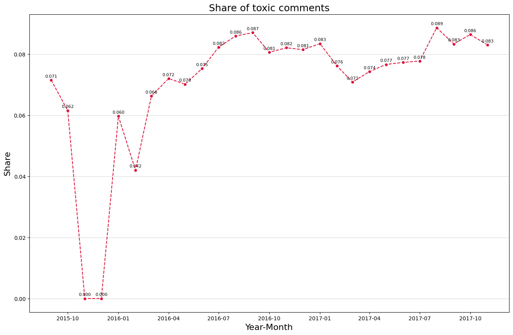
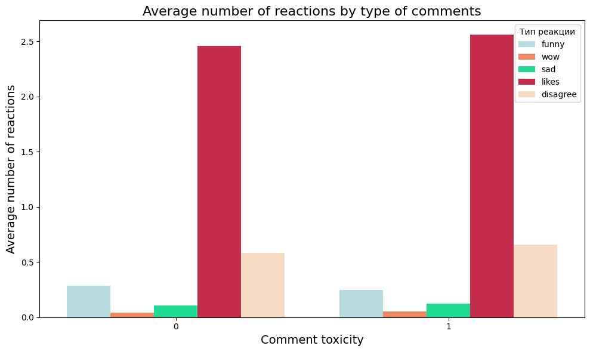

1. Сбор данных
    - Проведен сбор данных и изучены основные характеристики нашего датасета.

2. Очистка данных
    - В процессе анализа были обнаружены дубликаты в столбце комментариев.
    - Проведена очистка данных: сохранены строки с максимальным значением toxicity_annotator_count.
    - Это позволило избежать повторов для дальнейшего изучения данных и построения модели.

3. Анализ поведения каждого признака в отдельности, его связь с целевой переменной, а также попарные корреляции
    - Проведен временной анализ комментариев
      - Пришли к выводу что количество как обычных, так и токсичных комментариев увеличивается со временем. Доля токсичных комментариев возросла с 6.6% до 8.7% в период с марта по октябрь 2016 года.
      

   - Проанализирована токсичность комментариев в течение суток
     - Пришли к выводу что доля токсичных комментариев начинает повышаться с 23:00, достигая пика в 9% к 8:00.  
     - 

   - Проведен анализ эмодзи и заглавных букв (КАПС) 
     - Вывод - эмодзи не влияют на токсичность, но заглавные буквы встречаются в токсичных комментариях, список наиболее популярных капс-слов составлен. 
     - 

    - В рамках анализа связи реакций и токсичности (0 это обычные комментарии а 1 токсичные)
    - Можно сделать увидеть отсутствие прямой корреляции, кроме реакции лайков.
      

    - Проведен анализ токсичности и ее подтипов, составлена таблица корреляции. 
    - Вывод - переменная toxicity наиболее сильно коррелирует с threat и умеренно с obscene и identity_attack
      

    - Исследовано наличие ссылок в комментариях: всего 3% обычных и 1.3% токсичных комментариев содержат ссылки, связи с токсичностью не выявлено.

    - Анализ длины комментариев показал, что в обычных комментариях больше длинных сообщений (более 950 символов).

4. Начата работа по NLP, включая токенизацию, обработку текста и анализ частей речи, с фокусом на связи между длиной комментариев и их токсичностью.