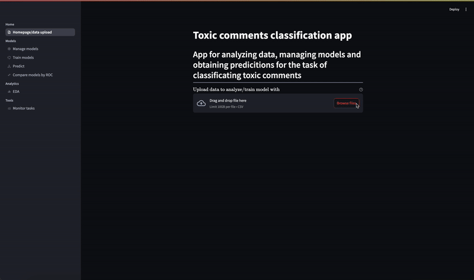
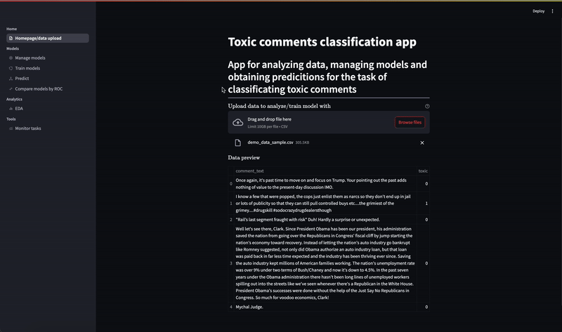
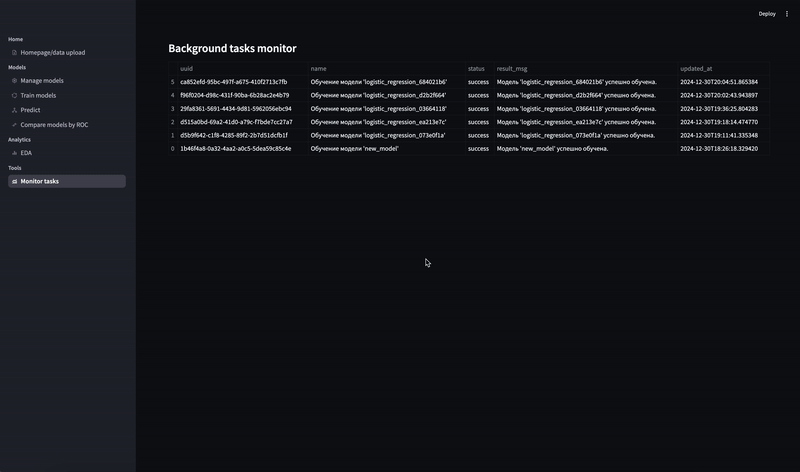
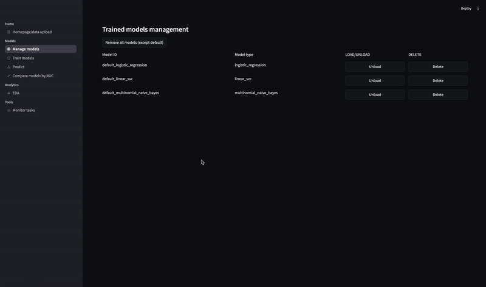
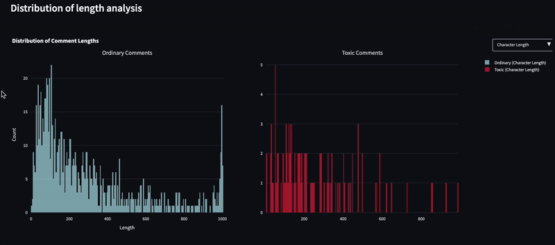
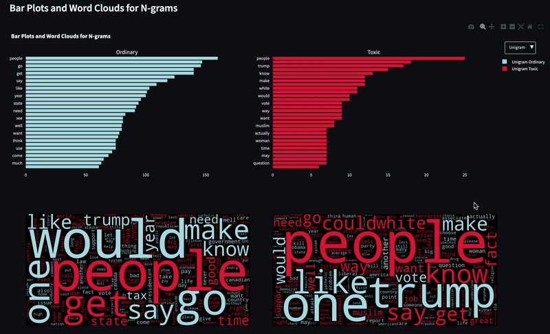

# User guide

## Начало работы с приложением

Главной точкой входа в интерфейс является Вкладка Homepage/data upload вы загружаете файл csv с комментариями - обязательно наличие столбцов toxic и comment_text - после загрузки вы можете просмотреть отрезок dataframe загруженного файла(Мы просим по возможности использовать файл demo_data_sample.csv который лежит в корне папки SERVICE - для демонстрации работы проекта. Стоит отметить, что данные предоставляются исключительно в целях демонстрации работы сервиса и не более.



## Обучение моделей

Для того, чтобы обучить модели машинного обучения на загруженных данных необходимо перейти во вкладку **<u>Train models</u>**. Далее необходимо выбрать модель среди доступных в сервисе моделей ($Logistic Regression$, $Linear SVC$, $Naive Bayes$), а затем выбрать необходимые гиперпараметры (для каждой модели доступен свой отдельный диапазон гиперпараметров). Затем после того как был выбор был совершен необходимо нажать на кнопку <u>Apply params and fit</u>.



## Мониторинг обучения моделей

Для того, чтобы узнать состояние обучения модели необходимо перейти на вкладку **<u>Monitor task</u>**. В случае, если в колонке <u>status</u> для обученной модели появляется значение *success*, то модель прошла обучение и готова к использованию.


## Применение моделей

Для того, чтобы в дальнейшем использовать обученную модель необходимо перейти во вкладку **<u>Manage models</u>** и нажать рядом с названием обученной модели кнопку <u>Load</u>. При этом изначально в сервисе доступны модели предобученные на большом объеме данных модели $Logistic 
 Regression$, $Linear SVC$ и $Naive Bayes$ с подобранными отдельно гиперпараметрами. Также можно удалять модели обученные пользователем модели. Есть вариант либо удалить из сервиса определенную модель нажав кнопку <u>Delete</u> рядом с названием модели, либо можно удалить все модели обученные пользователем нажав кнопку <u>Remove models (except default)</u>.

#### Delete


#### Remove models (except default)


### Получение предсказаний моделей

Для дальнейшего получения предсказаний моделей необходимо перейти во вкладку **<u>Predict</u>**. Далее необходимо выбрать модель для предсказания в окне <u>Select model</u> ввести текст комментария в окно ввода <u>Enter new line separated texts to predict toxicity for</u>, а затем нажать на кнопку <u>Obtain predictions</u>. При этом имеется возможность получить предсказания по нескольким комментариям просто введя комментарии через создание новой строки для каждого комментария.



### Сравнение моделей после обучения 

В сервисе имеется возможность сравнить модели по ROC кривым обучения. Для этого необходимо перейти во вкладку **<u>Compare models by ROC</u>**. После этого нужно будет выбрать одну или несколько моделей в поле <u>Select a model</u>, а затем будет необходимо нажать на кнопку <u>Построить графики</u>. При этом данные для построения графиков будут использоваться те же, что и были загружены ранее. Однако имеется возможность загрузить и другие данные просто убрав галочку с <u>Use previous (train) data</u>. Таккже помимо кривых на графике выводятся метрики AUC для разных моделей.


## EDA

В сервисе имеется возможность отображения интерактивных аналитических графиков EDA. Для этого после загрузки данных необходимо перейти на вкладку **<u>EDA</u>**. Далее необходимо подождать какое-то время, чтобы данные для графиков обработались, а затем уже и графики отрисовались. Стоит отметить, что отрисовка графиков может занимать значительное количество времени, так как обработка данных в этом разделе довольно-таки ресурсоемкая. На выходе для пользователя будут доступны три графика: график распределения длины текста, график частосты частей речи и графики частоты слов в комментариях. 


### График распределения длины текста



### График частоты частей речи


### Графики частоты слов




## Docker

В рамках сервиса реализовали докеризацию проекта - создали 2 контейнера backend и frontend. Использованы собственные Dockerfile для сборки каждого контейнера.

Для сборки и запуска контейнеров локально нужно в директории SERVICE/infra-dev/ создать файл .env и поместить туда переменные из .env.dev.template, затем выполнить:

```
docker compose up -d
```

## Деплой на сервер

Сервис развернут на сервере - развернутый сервис можно найти по следующему адресу http://89.110.90.133/

На данном этапе деплой производился руками. Взаимодействие с сервером происходило через SSH-соединение. Были добавлены на сервер файлы infra/docker-compose.yml, env-файл с переменными окружения и файл nginx.conf для конфигурации NGINX. Заранее собранные образы тянутся с DockerHub командой docker compose pull.

