# Использование моделей RandomForestClassifier и DecisionTreeClassifier

Мы проводили исследование сможем ли мы достичь лучших показателей при использовании моделей RandomForestClassifier и DecisionTreeClassifier. Исследование проводилось как с применением BOW так и с применением TF-IDF

На RandomForestClassifier BoW удалось добиться следующих результатов 

| Метрика   | Train | Val  | Test |
|-----------|-------|------|------|
| Precision | 0.39  | 0.39 | 0.40 |
| Recall    | 0.68  | 0.68 | 0.67 |
| F1        | 0.50  | 0.50 | 0.50 |

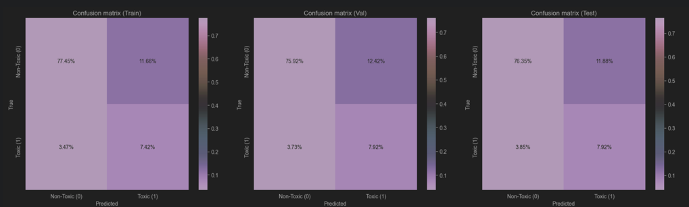
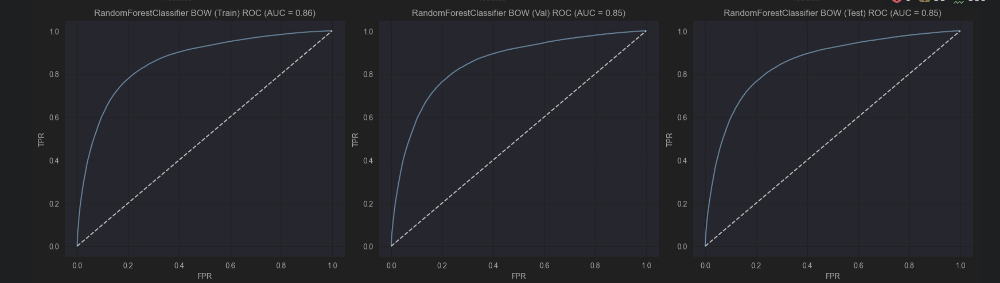
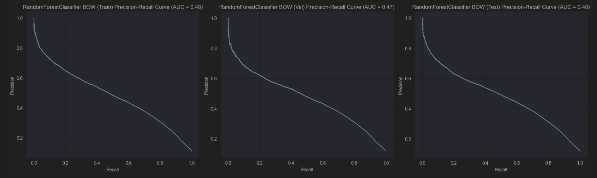

На RandomForestClassifier TFIDF удалось добиться следующих результатов

| Метрика   | Train | Val  | Test |
|-----------|-------|------|------|
| Precision | 0.44  | 0.44 | 0.45 |
| Recall    | 0.69  | 0.68 | 0.67 |
| F1        | 0.54  | 0.53 | 0.54 |

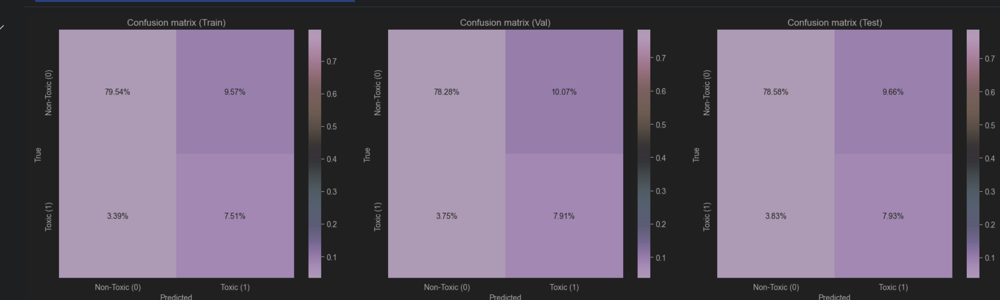
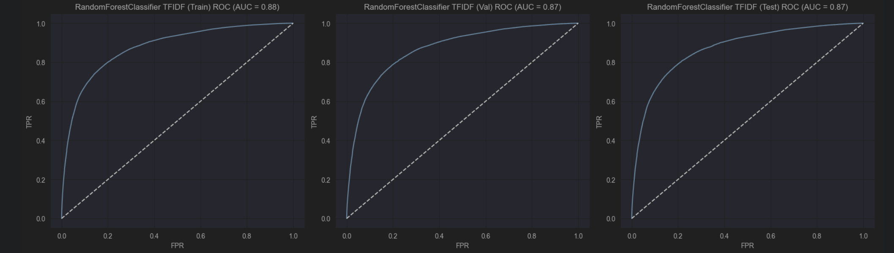
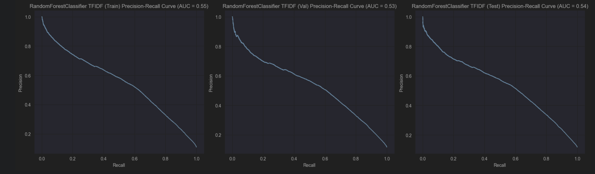

На DecisionTreeClassifier BoW удалось добиться следующих результатов

| Метрика   | Train | Val  | Test |
|-----------|-------|------|------|
| Precision | 0.78  | 0.78 | 0.79 |
| Recall    | 0.26  | 0.23 | 0.24 |
| F1        | 0.39  | 0.36 | 0.36 |

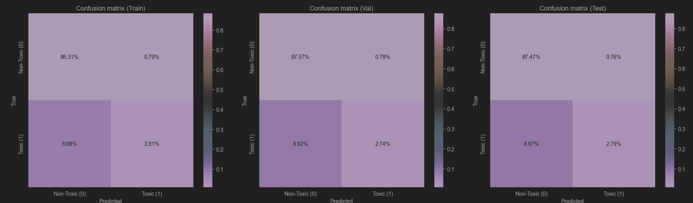
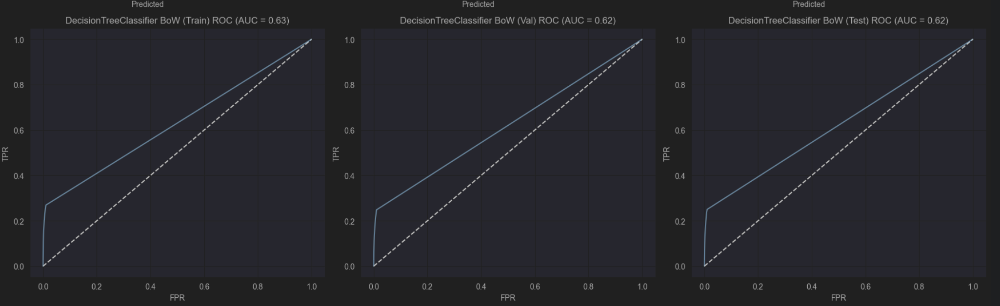
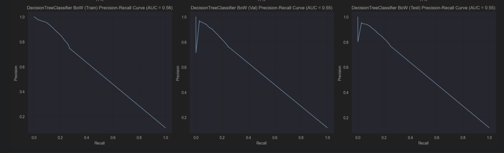

На DecisionTreeClassifier TFIDF удалось добиться следующих результатов

| Метрика   | Train | Val  | Test |
|-----------|-------|------|------|
| Precision | 0.81  | 0.80 | 0.80 |
| Recall    | 0.24  | 0.23 | 0.23 |
| F1        | 0.37  | 0.35 | 0.36 |

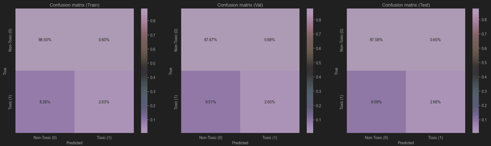
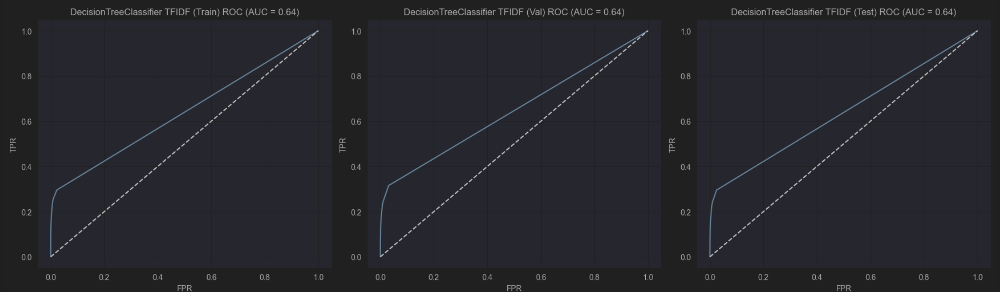
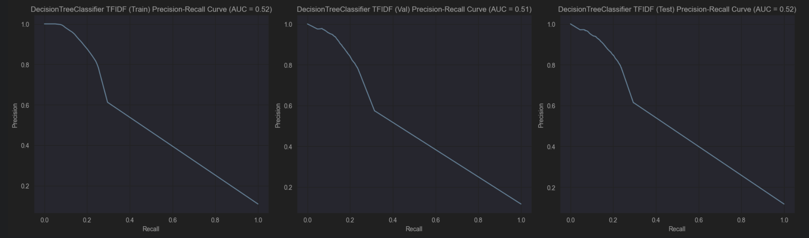

Использование моделей `RandomForestClassifier` и `DecisionTreeClassifier` не дало лучших показателей по метрикам по сравнению с `Linear_SVC`.
